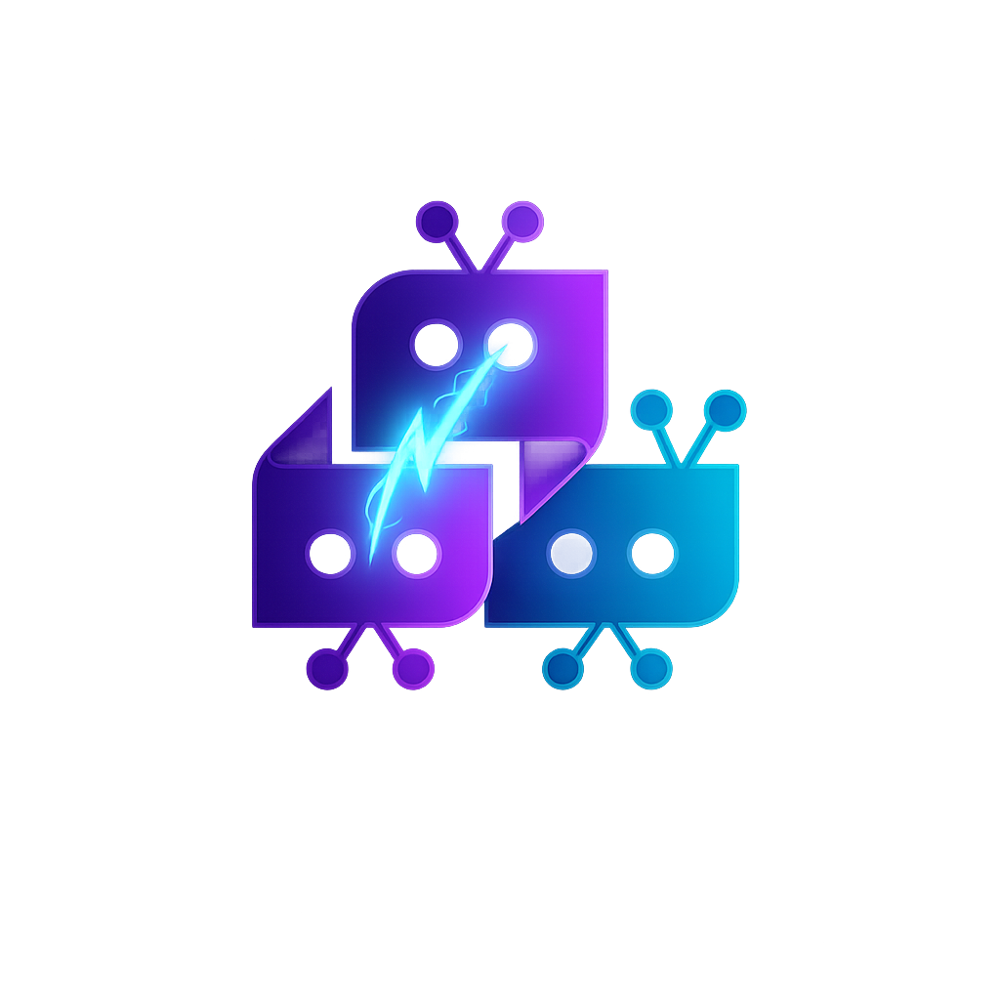
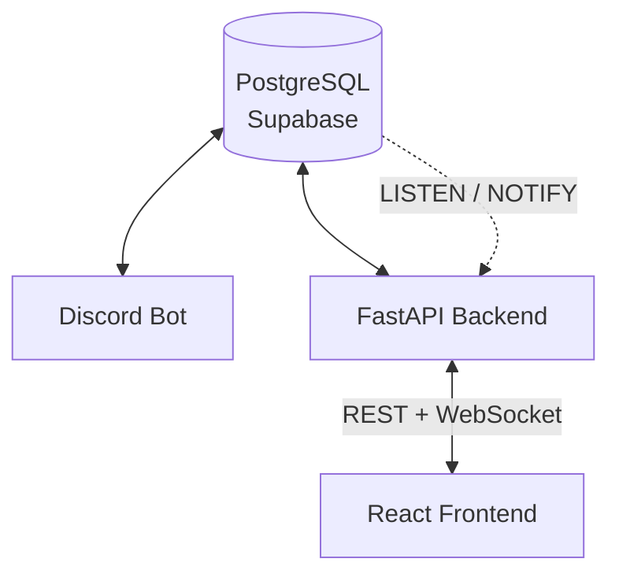

<div align="center">


<h1>Disqueue</h1>

<h3>No queue. No command. Just play.</h3>

</div>

<br />

## About

Most matchmaking bots make you run a command and sit in a queue, hoping someone else in *your* server does the same at the same time. Disqueue watches Discord's own presence data instead — the moment two people across *any* server it's in are playing the same game, they're matched. No command, no queue, nothing to remember.

It also isn't just a bot. A live web dashboard, built on the same real-time data, gives users a place to manage preferences and track match history outside of Discord too.

<br />

## Features

- Automatic presence detection — matching starts the moment you start playing
- Cross-server matching — pairs players across every server Disqueue is in
- Configurable rules — region, language, mode, cooldowns, limits, DND hours
- Optional match confirmation via DM before a match is finalized
- Blocklist support
- Live web dashboard, synced in real time over WebSocket
- Private match threads for each confirmed pair

<br />

## Architecture



The bot and backend connect to the same database independently. Postgres triggers `NOTIFY` writes — new matches, preference changes, notifications — which the backend picks up via a dedicated `LISTEN` connection and pushes to clients over WebSocket.

<br />

## Stack

| | |
|---|---|
| **Bot** | Python, discord.py |
| **Backend** | FastAPI, asyncpg |
| **Frontend** | React 19, Vite, Tailwind |
| **Infra** | Supabase, Render, Vercel, Bot-Hosting.net |

<br />

## Getting Started

<details>
<summary>Setup instructions</summary>

<br />

**Prerequisites:** Python 3.11+, Node.js 20+, a PostgreSQL database, and a [Discord application](https://discord.com/developers/applications) with a bot token and OAuth2 credentials.

Run `schema.sql` against your Postgres instance first.

```bash
# Bot
cd bot && pip install -r requirements.txt
cp .env.example .env   # DISCORD_TOKEN, DATABASE_URL
python main.py
```

```bash
# Backend
cd backend && pip install -r requirements.txt
cp .env.example .env   # DATABASE_URL, DISCORD_CLIENT_ID/SECRET, JWT_SECRET
uvicorn main:app --reload
```

```bash
# Frontend
cd frontend && npm install
cp .env.example .env   # VITE_API_URL, VITE_WS_URL
npm run dev
```

</details>

<details>
<summary>Environment variables</summary>

<br />

**Bot** — `DISCORD_TOKEN`, `DATABASE_URL`

**Backend** — `DATABASE_URL`, `LISTENER_DATABASE_URL`, `DISCORD_CLIENT_ID`, `DISCORD_CLIENT_SECRET`, `DISCORD_REDIRECT_URI`, `FRONTEND_CALLBACK_URL`, `JWT_SECRET`

**Frontend** — `VITE_API_URL`, `VITE_WS_URL`

</details>

<details>
<summary>Deployment</summary>

<br />

Each service deploys independently and points at the same Supabase instance.

- **Bot** → Bot-Hosting.net
- **Backend** → Render, UptimeRobot
- **Frontend** → Vercel
- **Database** → Supabase

</details>

<br />

## Commands

<details>
<summary>Full command list</summary>

<br />

| Command | Description |
|---|---|
| `/enable` | Start receiving match notifications |
| `/disable` | Stop receiving match notifications |
| `/status` | See who's currently playing what |
| `/match-history` | View your recent matches |
| `/set-game-mode` | Choose Casual, Ranked, or Any |
| `/match-confirmation` | Toggle manual confirmation on/off |
| `/set-match-limit` | Set a daily match cap |
| `/set-match-cooldown` | Set time between matches |
| `/block` / `/unblock` | Block or unblock a user by mention |
| `/blockid` / `/unblockid` | Block or unblock a user by ID |
| `/set-region` | Set your matching region |
| `/set-language` | Set your matching language |
| `/set-name` | Set your display name |
| `/set-bio` | Set a short bio shown to matches |
| `/preferences` | View your current settings |
| `/set-timezone` | Set your timezone |
| `/set-dnd` | Set quiet hours |
| `/unset-dnd` | Clear quiet hours |
| `/friend-notifications` | Get notified when friends start playing |
| `/reset` | Reset all preferences to default |

</details>

<br />

## Roadmap

- [ ] Ranked skill-based matching
- [ ] Server-level configuration
- [ ] Match feedback / rating system

<br />

## Support

<div align="center">

Need help, found a bug, or want to request a feature?

[](https://discord.gg/J5vgCFjuGd)

</div>
